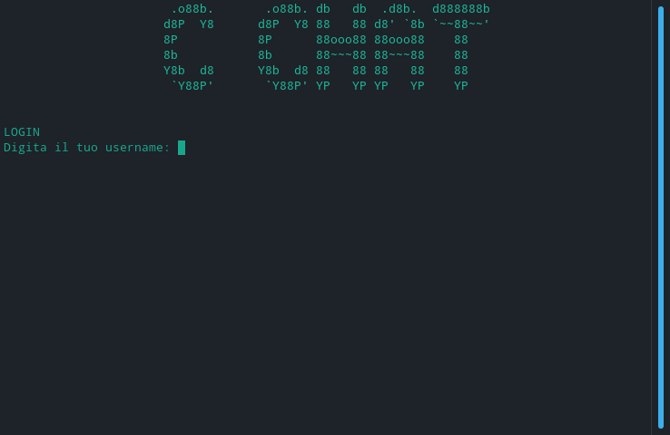
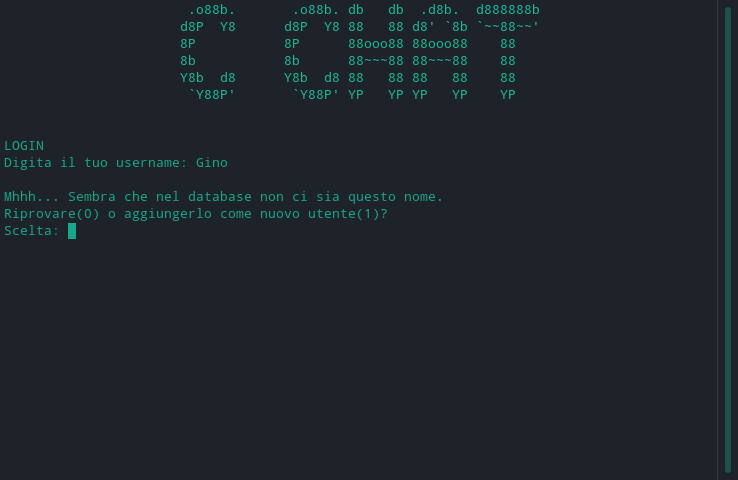
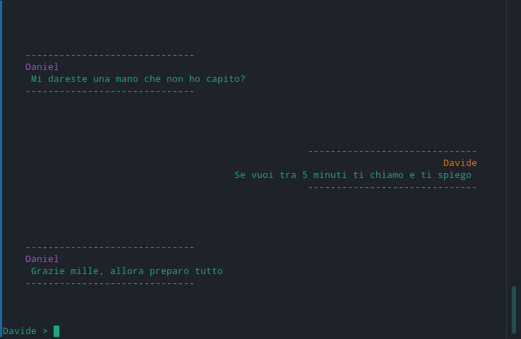
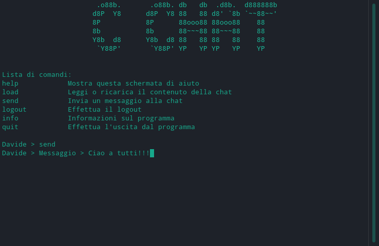
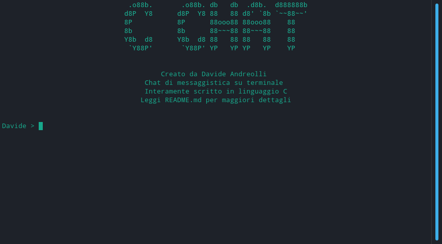
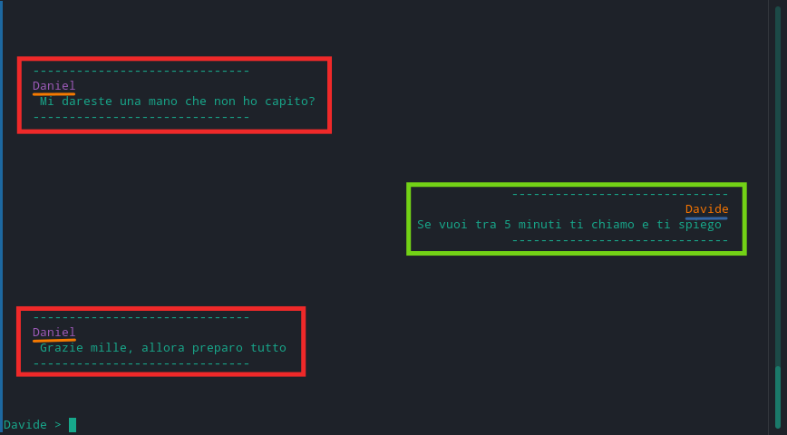

# C Chat

C Chat permette di scambiare messaggi tra amici e compagni di progetto direttamente dal terminale.
Essendo cross-platform è possibile scambiare messaggi anche tra diversi sistemi operativi (es. Windows -> Linux)

## Esecuzione


#### Windows (cmd)
1. Unzippa la cartella compressa con il programma apposito installato, ad esempio **7zip**
2. Eseguire il file:
```cmd
:: Spostiamoci nella cartella
cd cchat

:: Diamo l'avvio all'eseguibile
/bin/CChat.exe
```

#### Linux e Mac (bash)
1. Unzippa la cartella compressa usando il comando **unzip**:
```bash
# Installiamo o cerchiamo l'aggiornamento per unzip (Debian) ed estraiamo
sudo apt-get install unzip
unzip CChat.zip -d .

# Spostiamoci nella cartella
cd cchat
```
2. Eseguire il file:
```bash
# installiamo make e compiliamo
sudo apt-get install make
make

# Diamo l'avvio all'eseguibile
./CChat
```

## Utilizzo

### LOGIN



Questa è la schermata di login del programma. Non necessita di una password, ma solo di un nome utente.

Nel caso il nome utente fosse stato inserito per la prima volta chiederà se ritentare l'accesso (nel caso ci fosse stato un errore di battitura ad esempio) o se registrarlo



Digitando zero e premendo invio ci sarà richiesto nuovamente il nome utente come all'avvio del programma.
In caso contrario, cioè se scegliamo 1, verrà aggiunto il nome utente e si verrà indirizzati al menù.


### MENÙ

Una volta compiuto l'accesso compare la riga di comando per poter interagire con il programma.
I comandi che possono essere imposti sono:
- ### load: 
		Carica i messaggi precedentemente scritti


- #### send:
		Invia un messaggio


- #### logout:
		Ritorna alla schermata di login


- #### info:
		Mostra la descrizione del programma e i crediti

- #### exit:
		Esce dal programma
		
## PARTICOLARITÀ
- Ogni utente si può riconoscere facilmente sulla chat dal colore del nome, infatti ogni persona ha un proprio id che gli assegna un colore nella chat
- La chat è strutturata come le chat più moderne, cioè i propri messaggi sono allineati a destra per distinguerli facilmente da quelli degli altri partecipanti, che sono allineati a sinistra



#### Credits: Davide Andreolli, 2020
#### Github: andreolli-davide/CChat
